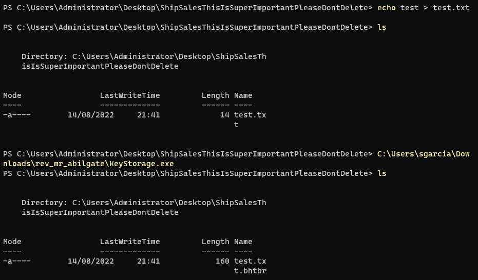
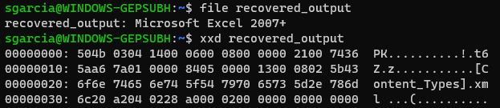

**_"Mr. Abilgate, the CFO of a Fortune 500 company, has reportedly been the victim of a recent spree of ransomware attacks. The behaviour of the malware seems consistent with our current APT target's tactics, but the ransom note makes us think it's a targeted attack. We suspect bad faith from corporate espionage gone wrong. Could you investigate?"_**

Mr Abilgate was a medium difficulty reversing challenge from the Business CTF organized by HTB in 2022. Initially, we are provided with two files, a Windows PE32 and what seems to be an Excel spreadsheet that has been encrypted by a ransomware. Let's start by analysing the behaviour of the included "KeyStorage" executable by monitoring its activity with [Procmon](https://docs.microsoft.com/en-us/sysinternals/downloads/procmon).

Upon running the executable, one event in particular caught my attention.

As we can see, the program is trying to access `C:\Users\Administrator\Desktop\ShipSalesThisIsSuperImportantPleaseDontDelete` with result `PATH NOT FOUND`. This seems to be the path where the ransomware tries to encrypt files from so let's create a test file inside it, adjust the path permissions properly and run the ransomware again. 


Checking the contents of the newly generated `test.txt.bhtbr` file with xxd reveals that the file is indeed encrypted. We got the ransomware working as intended!


The first thing I tried from this point was to load the executable into Ghidra praying that no obfuscation was being used, but I quickly gave up after not getting any useful information for a while and opted for a dynamic analysis approach instead.

In order to discover what this ransomware is really doing to the files and what kind of encryption it is using, I decided to leverage FRIDA's dynamic instrumentation capabilities. In this writeup, I won't go in depth with how this framework is used, but there are amazing resources out there such as [learnfrida.info](https://learnfrida.info/) that explain everything needed to solve this challenge.

My first step was to enumerate the modules that the process had loaded. For this, run "KeyStorage.exe" with FRIDA using the following commands:
1.  `frida -f .\KeyStorage.exe`
2.  `Process.enumerateModules()`

Aha! Two crypto-related modules were loaded, `CRYPT32.dll` and `bcrypt.dll`.


Then, I used FRIDA to try and trace calls to functions with the string "crypt" in their name. As a side note, remember to create a new test file inside the aforementioned path for each run so the ransomware has new files to encrypt.
`frida-trace -f .\KeyStorage.exe -i "*crypt*/i"`


Hmm so BCrypt is indeed being used to encrypt the files but we don't know yet which algorithms are being applied. But before getting into that, there are some things that can be deduced from this trace. Three main sections stand out to me, a first one where some data is hashed, a second one where an encryption key is generated and lastly, a third one where the file is encrypted.

After looking up in [Microsoft's documentation](https://docs.microsoft.com/en-us/windows/win32/api/bcrypt/) every function of the trace, I learned that the calls to `BCryptOpenAlgorithmProvider` are used to initialize a crypto provider with a string that identifies the crypto algorithm to apply as an argument. 


A FRIDA handler can be used for this function to get the parameters that indicate the algorithms being used for each of the two calls.
```javascript
onEnter(log, args, state) {
    log('BCryptOpenAlgorithmProvider()');
    console.log("\n Entering BCryptOpenAlgorithmProvider()...");
    console.log(args[1].readUtf16String());
    console.log(args[2].readUtf16String());
  }
```

With this, we now know that one provider is dedicated to the initial hashing with SHA256 while the other handles file encryption with AES.


Reading the documentation also taught me that the function `BCryptGenerateSymmetricKey` derives a new key from a supplied one and that `BCryptFinishHash` is used to return the generated hash. One could think that the hashed bytes are being used to generate a key which then will be used to encrypt the files. This can also be tested by checking the arguments for some of the BCrypt functions with FRIDA hooks.


*`BCryptFinishHash` Return value. Since the output is constant between runs we can skip the hashing part for our decryption tool.*


*`BCryptGenerateSymmetricKey` uses the hashed bytes as its input key!*


*Trace of `BCryptGenerateSymmetricKey` and `BCryptEncrypt`.*

Now we know everything we need to create a program that decrypts the provided spreadsheet. Let's recap:
- Some constant bytes are hashed with SHA256 at the beginning.
- The resulting bytes are derived to generate an encryption key.
- The bytes of the target file are encrypted using AES with the generated key.
- The encrypted result is written to disk with name \*.bhtbr

Since programming C++ code for Windows can be a bit cumbersome (at least for me) I based the code on this [Microsoft tutorial](https://docs.microsoft.com/en-us/windows/win32/seccng/encrypting-data-with-cng) about how to properly use the BCrypt API to encrypt/decrypt data.

After some trial and error, this is a working proof of concept in C++ that decrypts files encrypted by the provided ransomware.

```c++
#include "Windows.h"
#include <bcrypt.h>
#include "stdint.h"
#include <iostream>
#include <fstream>
#include <vector>
#pragma comment(lib, "bcrypt.lib")

#define NT_SUCCESS(Status)          (((NTSTATUS)(Status)) >= 0)
#define STATUS_UNSUCCESSFUL         ((NTSTATUS)0xC0000001L)

using namespace std;

vector<char> readFile(const char* path){
    ifstream ifd(path, ios::binary | ios::ate);
    if (!ifd){
        wprintf(L"Couldn't open input file\n");
        exit(1);
    }

    int size = ifd.tellg();
    ifd.seekg(0, ios::beg);
    vector<char> buffer;
    buffer.resize(size);
    ifd.read(buffer.data(), size);
    ifd.close();

    return buffer;
}

bool writeFile(const char* path, char* pbPlainFile, size_t cbPlainFile){
    bool success = true;

    ofstream ofd(path, ios::out | ios::binary);
    if (!ofd) {
        wprintf(L"Couldnt open output file\n");
        exit(1);
    }

    ofd.write(pbPlainFile, cbPlainFile);
    ofd.close();
    if (!ofd.good())
        success = false;
    
    return success;
}

int main(int argc, char** argv){

    NTSTATUS status = STATUS_UNSUCCESSFUL;
    BCRYPT_ALG_HANDLE hAesAlg = NULL;
    BCRYPT_KEY_HANDLE hKey = NULL;
    PBYTE pbKeyObject = NULL;
    DWORD cbKeyObject = 0;
    DWORD cbData = 0;
    DWORD cbCipherText = 0;
    PBYTE pbEncFile = NULL;
    DWORD cbEncFile = 0;
    PBYTE pbPlainFile = NULL;
    DWORD cbPlainFile = 0;
    DWORD cbBlockLen = 0;

    if (argc < 3){
        wprintf(L"Usage %hs <encrypted_file> <output_file>", argv[0]);
        exit(1);
    }

    char* inputFilePath = argv[1];
    char* outputFilePath = argv[2];
    wprintf(L"Recovering %hs...\n", inputFilePath);

    vector<char> file_vector = readFile(inputFilePath);
    uint8_t* enc_data = (uint8_t*)file_vector.data();
    cbEncFile = file_vector.size();

    // This is the result of the BCryptFinishHash function call.
    const uint8_t initial_key[32] = {
    0x49, 0x3B, 0x94, 0x2E, 0xF1, 0x6B, 0xF5, 0x9D, 0x72, 0x54, 0xBB, 0x9A, 0x64, 0x6A, 0xC3, 0x39, 
    0x57, 0x8C, 0x8E, 0xDE, 0x50, 0xAC, 0xC9, 0xD2, 0x0A, 0x13, 0xC6, 0xF1, 0x4F, 0x68, 0xD5, 0x93
    };
    
    // Open an algorithm handle.
    if(!NT_SUCCESS(status = BCryptOpenAlgorithmProvider(
                                                &hAesAlg,
                                                BCRYPT_AES_ALGORITHM,
                                                NULL,
                                                0)))
    {
        wprintf(L"**** Error 0x%x returned by BCryptOpenAlgorithmProvider\n", status);
    }

    // Calculate the size of the buffer to hold the KeyObject.
    if(!NT_SUCCESS(status = BCryptGetProperty(
                                        hAesAlg, 
                                        BCRYPT_OBJECT_LENGTH, 
                                        (PBYTE)&cbKeyObject, 
                                        sizeof(DWORD), 
                                        &cbData, 
                                        0)))
    {
        wprintf(L"**** Error 0x%x returned by BCryptGetProperty\n", status);
    }

    // Allocate the key object on the heap.
    pbKeyObject = (PBYTE)HeapAlloc (GetProcessHeap (), 0, cbKeyObject);
    if(NULL == pbKeyObject)
    {
        wprintf(L"**** memory allocation failed\n");
    }

    if(!NT_SUCCESS(status = BCryptGenerateSymmetricKey(
                                        hAesAlg, 
                                        &hKey, 
                                        pbKeyObject, 
                                        cbKeyObject, 
                                        (PBYTE)initial_key, 
                                        sizeof(initial_key), 
                                        0)))
    {
        wprintf(L"**** Error 0x%x returned by BCryptGenerateSymmetricKey\n", status);
    }

    // Get the size of the decrypted byte array
    pbEncFile = enc_data;
    if(!NT_SUCCESS(status = BCryptDecrypt(
                                    hKey, 
                                    pbEncFile, 
                                    cbEncFile, 
                                    NULL,
                                    NULL,
                                    NULL,
                                    NULL, 
                                    0, 
                                    &cbPlainFile, 
                                    NULL)))
    {
        wprintf(L"**** Error 0x%x returned by BCryptDecrypt\n", status);
    }

    // Allocate the decrypted byte array on the heap
    pbPlainFile = (PBYTE)HeapAlloc (GetProcessHeap (), 0, cbPlainFile);
    if(NULL == pbPlainFile)
    {
        wprintf(L"**** memory allocation failed\n");
    }

    // Decrypt the byte array
    if(!NT_SUCCESS(status = BCryptDecrypt(
                                    hKey, 
                                    pbEncFile, 
                                    cbEncFile, 
                                    NULL,
                                    NULL, 
                                    NULL,
                                    pbPlainFile, 
                                    cbPlainFile, 
                                    &cbPlainFile, 
                                    NULL)))
    {
        wprintf(L"**** Error 0x%x returned by BCryptDecrypt\n", status);
    }

    if (writeFile(outputFilePath, (char*)pbPlainFile, cbPlainFile)){
        wprintf(L"Success! Recovered file written to %hs\n", outputFilePath);
    } 
    
    else {
        wprintf(L"Error writing the output to a file.\nOUTPUT:");
        for (unsigned i = 0; i < cbPlainFile; ++i){
            printf("%02x ", pbPlainFile[i]);
        }
    }
}
```

Running it against the encrypted spreadsheet leaves us with the decrypted file where the flag is located!
**FLAG**: `_HTB{b1g_br41ns_b1gg3r_p0ck3ts_sm4ll3r_p4y0uts}`<br>



